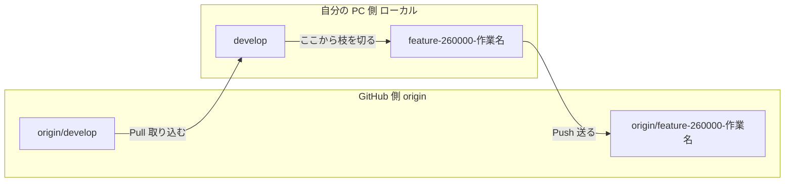
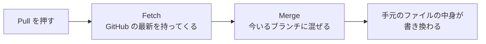
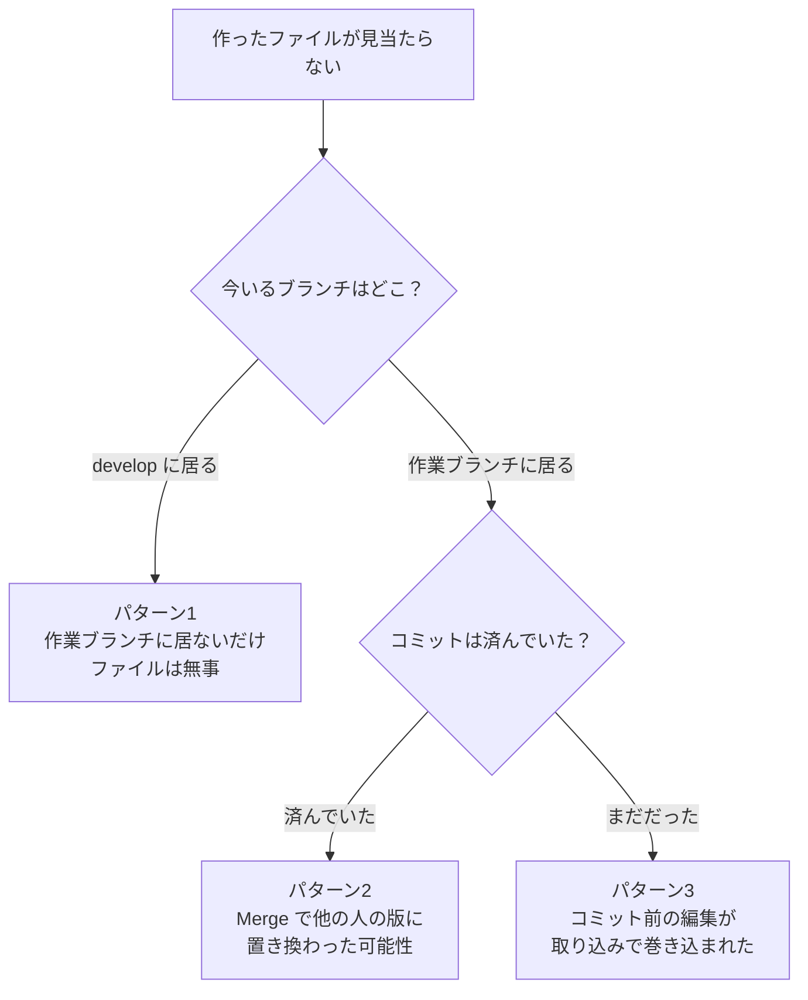
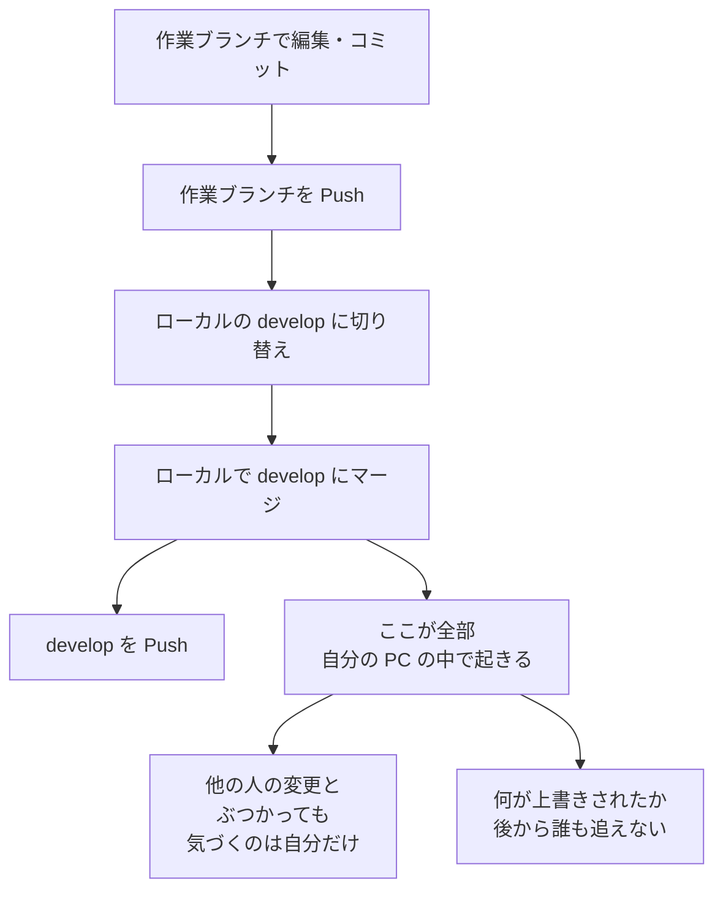
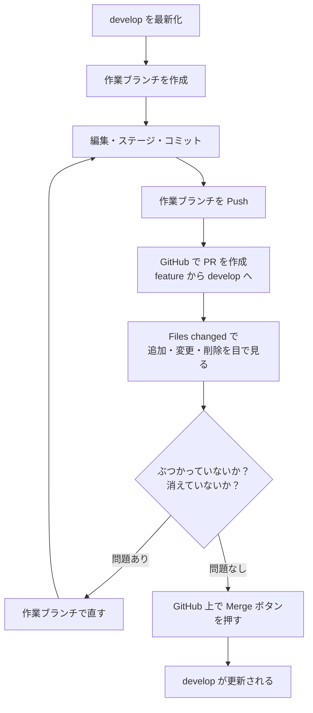
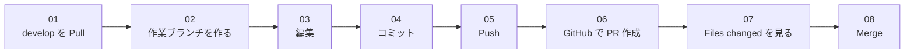

# 現行フローの状況分解と PR 運用への改善案

この資料は、次の3つを順に説明します。

1. 図の見方（どこに何が置いてあるか）
2. 今回「ファイルが消えた」ときに何が起きていたか
3. PR 運用にすると、消える事故と上書きが起きる前に見えるようになること

---

## 0. 先に用語を3つだけ

| 言葉 | 意味 | 場所 |
|---|---|---|
| origin | GitHub 上にあるリポジトリ本体。全員が共有する | インターネット側 |
| ローカル | 自分の PC の中にあるコピー。ここで編集する | 自分の PC |
| ブランチ | 作業の並行世界。切り替えると、見えるファイルの中身が丸ごと変わる | 両方にある |

ここで一番大事なのは3つ目です。ブランチを切り替えると、エディタに見えているファイルの中身が入れ替わります。ファイルが見当たらないとき、消えたのではなく別のブランチに居るだけ、というのが最も多いケースです。

---

## 1. ファイルはどこに置かれているか

Git を触るとき、同じファイルが2か所に存在します。この2か所の関係が分かれば、Pull と Push が何をしているかも分かります。

| 操作 | 向き | 何が起きるか |
|---|---|---|
| Clone | GitHub から PC へ | 最初の1回だけ。リポジトリ全体を PC に複製する |
| Pull | GitHub から PC へ | GitHub 側の変更を、今いるブランチに取り込む |
| Push | PC から GitHub へ | 自分のコミットを GitHub 側へ送る |
| 編集・ステージ・コミット | PC の中だけ | GitHub には何も伝わらない。Push して初めて届く |

編集してもコミットしても、Push するまで GitHub には何も届きません。逆に、他の人が Push した変更は、Pull するまで自分の PC には来ません。

---

## 2. 今回、何が起きていたか

### 2-1. Pull は「取り込む」ではなく「取り込んで、混ぜる」

Pull というボタンは、内部では2つの操作をまとめて実行しています。

問題はこの2つ目です。Merge は、今自分が居るブランチのファイルを書き換えます。どのブランチに居るかを意識しないまま Pull を押すと、手元のファイルが変わります。

### 2-2. 「消えた」ように見える3つのパターン

| パターン | 何が起きたか | ファイルは | 確認方法 |
|---|---|---|---|
| 1 | develop など別ブランチを見ている | 無事。見えていないだけ | `git branch` で今いる場所を見る。作業ブランチへ `git switch` すれば戻る |
| 2 | Merge で他の人の変更に上書きされた | 履歴には残っている | `git log -- ファイル名` でそのファイルの変更履歴を見る |
| 3 | コミット前の編集だった | Git がまだ知らないので戻せない場合がある | `git status` で未コミットの変更を先に確認する習慣をつける |

パターン3が一番怖いところです。コミットしていない編集は Git の管理下に入っていないため、Git は守ってくれません。

### 2-3. 「作業ブランチを Push してから develop を Pull する」は半分だけ正しい

作業者が自分で決めた対処は、事故の保険としては有効です。Push しておけば GitHub 側にコピーが残るので、手元が壊れても取り戻せます。

ただし、Pull で手元が書き換わること自体は止まりません。根本的には、develop への取り込みを自分の PC でやらない形にする必要があります。それが PR 運用です。

---

## 3. 現行運用（PR なし）の何が危ないか

危ないのはマージする場所です。自分の PC の中でマージすると、ぶつかったこと自体が自分にしか見えず、うっかり相手の変更を消した状態のまま Push できてしまいます。

---

## 4. 改善案：PR 運用にする

PR（Pull Request）は、マージを自分の PC ではなく GitHub 上で行う仕組みです。

変わるのは1点だけです。ローカルで develop にマージするのをやめて、GitHub 上でマージします。

---

## 5. PR 画面で実際に何が見えるか

PR を作る画面には、マージできるかどうかが作る前から表示されます。

| 表示 | 意味 | やること |
|---|---|---|
| Able to merge | ぶつかっていない。そのまま入る | Files changed を見て内容を確認し、作成 |
| Can't automatically merge | 同じ行を他の人も変更している（衝突） | どちらを残すか決めてから進める |

Can't automatically merge が出ても、この時点では何も壊れていません。develop も、相手の変更も、まだ無傷です。ここが現行運用との決定的な違いで、現行運用ではこれが自分の PC の中で起き、気づかず上書きして Push できてしまいます。

衝突が起きている実例はこちらです。

https://github.com/dekinaiNet/practice1/compare/develop...feature-003-conflict?expand=1

この PR では app.css の同じ行を、develop 側と作業ブランチ側の両方が別々に書き換えています。画面上部に Can't automatically merge が表示され、Files changed を開くと、どの行がぶつかっているかを作成前に確認できます。

### Files changed で必ず見る3点

| 見るところ | 何が分かるか |
|---|---|
| 緑の行（+） | 自分が追加した内容。作ったファイルがここに出ていれば、消えていない証拠になる |
| 赤の行（-） | 削除された内容。身に覚えのない赤があれば、そこで止めて確認する |
| ファイル名の一覧 | 触っていないファイルが混ざっていないか |

---

## 6. 現行運用と PR 運用の比較

| 項目 | 現行運用 | PR 運用 |
|---|---|---|
| マージする場所 | 自分の PC | GitHub 上 |
| 衝突に気づくタイミング | Pull した後。手元が既に書き換わっている | PR を作る前。まだ何も壊れていない |
| 消えたファイルの発見 | 目視で気づくしかない | Files changed の赤い行で分かる |
| 上書きしてしまったとき | 気づかず Push できる | Merge ボタンを押すまで反映されない |
| 変更理由・経緯 | 個人の記憶 | PR に文章として残る |
| 誰がいつ入れたか | 追いにくい | PR 単位で残る |

---

## 7. PR にしても解決しないこと

正直に書いておきます。

| 項目 | PR で解決するか |
|---|---|
| 今回消えたファイルの原因特定 | しない。既に起きたことは PR では分からない |
| コミットしていない編集の保護 | しない。コミットするまで Git は守らない |
| これから先の上書き事故 | する。マージ前に目で見て止められる |
| 何が入ったかの追跡 | する。PR 単位で残る |

コミットは、こまめに打つほど安全になります。PR は、コミット済みのものを守る仕組みです。

---

## 8. これからの手順

作業を始める前に、毎回この2つだけ確認してください。

| 確認 | コマンド | 見るもの |
|---|---|---|
| 今どのブランチに居るか | `git branch` | 印が付いている行が現在地 |
| 保存していない編集がないか | `git status` | 何も出なければ安全に切り替え・Pull できる |

---

## 結論

Pull は「取り込んで混ぜる」操作なので、押した瞬間に手元のファイルが書き換わります。現行運用ではこのマージが自分の PC の中で起きるため、ぶつかっても消えても、気づけるのは自分だけです。

PR 運用にすると、マージが GitHub 上に移ります。

作業ブランチを Push → GitHub で PR を作成 → Files changed で差分を確認 → Merge

これで、develop に入る前に「何が追加され、何が消えるのか」を目で見て止められるようになります。
