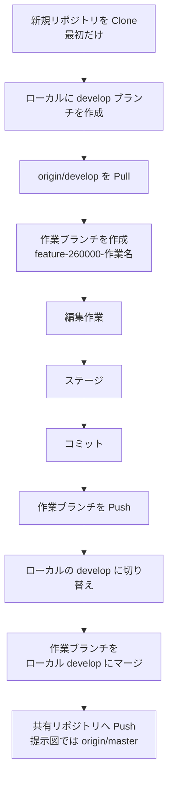
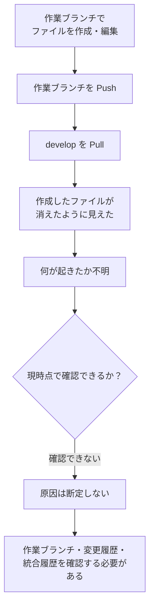
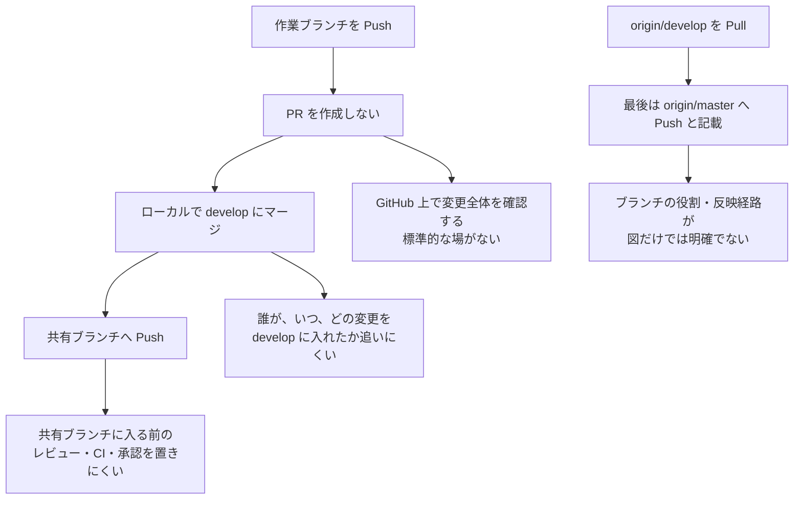
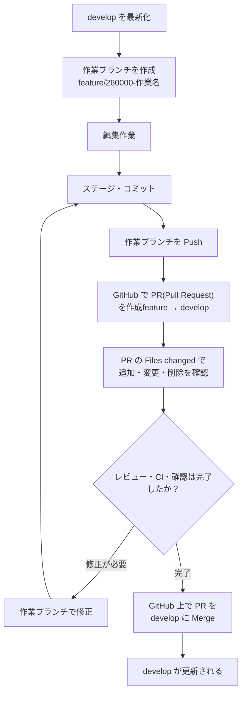

# 現行フローの状況分解と PR 運用への改善案

## 前提

この資料では、提示された図にある **現行フロー** を先に整理し、その後に Pull Request（PR）を導入する改善フローを示します。

提示図の現行フローには PR はありません。作業ブランチを Push した後、ローカル環境で `develop` に変更を取り込み、共有リポジトリへ反映する流れです。

また、図では `origin/develop` を Pull し、最後は `origin/master` へ Push する構成になっています。このブランチ間の役割と反映経路は、現行運用として確認が必要です。

---

## 1. 現行運用（PR なし）

### 現行フローの整理

| 段階 | 操作 | 現行フロー上の意味 |
|---|---|---|
| 1 | Clone | リポジトリをローカル環境へ取得する |
| 2 | `develop` を Pull | 共有側の `develop` の変更をローカルへ取り込む |
| 3 | 作業ブランチを作成 | タスク単位の変更を行う場所を作る |
| 4 | 編集・ステージ・コミット | 作業内容を作業ブランチの履歴に記録する |
| 5 | 作業ブランチを Push | 作業ブランチを共有リポジトリへ送る |
| 6 | ローカル `develop` にマージ | 作業ブランチの変更をローカルの `develop` に取り込む |
| 7 | 共有リポジトリへ Push | `develop` または図にある `master` へ変更を反映する |

---

## 2. 発生した事象の分解

確認できている事実は、次のとおりです。

- 作業者は作業ブランチでファイルを作成・編集した。
- 作業者は `develop` を Pull した。
- Pull の後、作成したファイルが消えたように見えた。
- 作業者自身は、何が起きたのか把握できていない。

この情報だけでは、ファイルが実際に削除されたのか、別のブランチを見ていたのか、統合時に何らかの変更が入ったのかは確認できません。**原因は現時点で特定不能です。**

---

## 3. 現行フローの問題点

### 問題の要点

- 作業ブランチを Push しても、その変更を `develop` に入れる前の確認を GitHub 上で行う工程がありません。
- ローカルでマージして共有ブランチへ Push するため、統合の判断・差分確認・レビューを個人のローカル操作に依存します。
- ファイルが消えたように見えたとき、変更がどの統合操作で起きたのかをチームで確認する入口が弱くなります。
- `origin/develop` を取得している一方で `origin/master` に Push する図になっており、どちらが開発の共有ブランチなのかを明確化する必要があります。

---

## 4. 改善フロー：Pull Request を使う

改善後は、作業ブランチを Push した後にローカルで `develop` へマージしません。GitHub 上で PR を作成し、確認・レビュー・CI を経て `develop` にマージします。

### 現行運用と改善運用の比較

| 項目 | 現行運用 | PR 運用 |
|---|---|---|
| 作業ブランチの Push 後 | ローカルで `develop` にマージする | GitHub で PR を作成する |
| `develop` へ入る前の確認 | ローカル操作に依存する | PR の **Files changed** で確認する |
| 統合操作 | ローカルでマージして共有側へ Push | GitHub 上で PR を Merge |
| レビュー・CI | 運用上の任意作業になりやすい | PR の確認工程として置ける |
| 変更理由・議論の記録 | 別途管理が必要 | PR に集約できる |
| 変更経緯の追跡 | ブランチやコミットを個別に追う | PR 単位で差分・レビュー・統合履歴を確認できる |

---

## 5. PR(Pull Request) が解決すること・しないこと

### PR が改善すること

- `develop` に入る前に、GitHub 上で追加・変更・削除されたファイルを確認できる。
- 作成したファイルが変更対象に含まれているかを、PR の **Files changed** で確認できる。
- 意図しないファイル削除や不要な変更を、マージ前に発見しやすくなる。
- 変更目的、レビューコメント、CI 結果、マージ履歴を PR 単位で残せる。
- 「どの変更で何が入ったか」をチームで追跡しやすくなる。

### PR だけでは断定・解決できないこと

- 今回の「ファイルが消えたように見えた」直接原因は、現時点の情報だけでは特定できない。
- PR を導入しても、既に起きた事象の原因が自動的に判明するわけではない。
- ただし PR 運用にすれば、今後の統合では変更内容と統合経路が可視化され、同種の問題を調査・説明しやすくなる。

## 結論

現行フローは、作業ブランチを Push した後、ローカルで `develop` にマージして共有側へ反映する、PR なしの運用です。

改善後は、次の流れを標準にします。

> **作業ブランチを Push → GitHub で feature から develop への PR を作成 → Files changed で差分を確認 → レビュー・CI → GitHub 上で develop にマージ**

これにより、共有ブランチに反映する前の確認場所と、後から追跡できる変更履歴を PR に集約できます。
